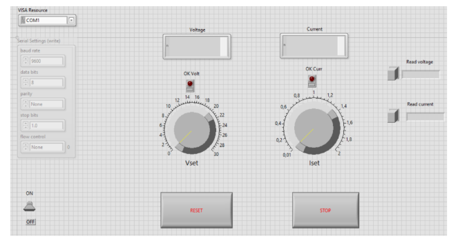
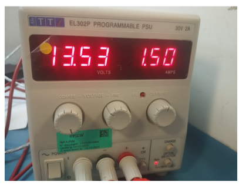

# 🔧 LabVIEW-Controlled Stabilized Power Supply

This project demonstrates the development of a LabVIEW-based application to **adjust and monitor the output voltage** of a stabilized power supply unit, specifically the **EL302P**. The system enables real-time control of the power supply via a graphical user interface (GUI), providing users with an efficient and safe way to manage voltage output in laboratory environments.

---

## ⚙️ Overview

- ✅ **Device**: EL302P Stabilized Power Supply (0–30V / 0–2A)
- 💻 **Interface**: LabVIEW GUI
- 🔌 **Connection**: Serial (RS-232 or USB, depending on model)
- 🎯 **Function**: Adjust voltage remotely and monitor in real time

---

## 🧩 Project Features

- Set desired **output voltage** from LabVIEW
- Monitor the **actual output voltage** and status
- Easy-to-use **graphical interface**
- Safe control with built-in validation and feedback
- Optional logging of voltage adjustments for analysis

---

## 📸 System Images

### 🖥️ GUI (LabVIEW Interface)

This image shows the custom-designed GUI in LabVIEW that allows the user to set the output voltage and observe real-time feedback:

---

### ⚡ Power Supply Hardware (EL302P)

This is the EL302P stabilized power supply used in this project:

---

## 🔄 How It Works

1. **User sets the desired voltage** using a control knob or numeric input on the LabVIEW interface.
2. The LabVIEW application communicates with the EL302P using **VISA (Virtual Instrument Software Architecture)** over a serial connection.
3. The **output voltage is adjusted** in real-time, and feedback is displayed on the interface.
4. Safety features ensure the output remains within acceptable limits.

